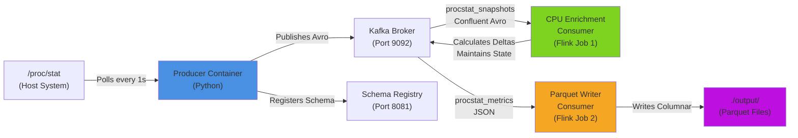

# Playing with Pipelines

This project explores common data technologies by creating an example pipeline using kafka, flink, avro, parquet, etc. It uses docker containers to separate concerns. The "stream" of data for the kafka topic is generated by polling `/proc/stat` within the `producer` container.

It's also been an experiment to see how much development and integration work I can offload to Copilot. The answer is, an alarming amount.


## Pipeline Architecture



## Assumptions
While docker commands can be run on any platform, the Makefile and instructions assume that you are running commands in a Posix-compatible (Unix) shell. It's been tested on WSL Ubuntu on Windows. Makefiles in particular do not get along with PowerShell or CMD.

## Make it go

This needs to be cleaned up, but for now - 

### Complete rebuild and smoke test (clean slate)
```bash
# 1. Tear down everything
# Warning - this removes Kafka topics and their contents. If you don't want to do this, omit -v
docker compose down -v

# 2. Clean build artifacts
make clean

# 3. Rebuild Docker images and Java consumer
make all

# 4. Start all services
docker compose up -d

# 5. Wait for services to be healthy (~30 seconds)
docker compose ps

# 6. Create Kafka topics and register schema
# These will probably be created automatically by the producer or the flink consumer if you wait a few minutes, but this ensures that they're present.
make setup

# 7. Wait for Flink job submission (~30 seconds)
docker logs jobmanager | grep "submitted"

# 8. Verify producer is writing
docker exec kafka kafka-console-consumer --bootstrap-server localhost:9092 --topic procstat_snapshots --from-beginning --max-messages 1 | grep Processed

# 9. Verify enrichment consumer is writing metrics
docker exec kafka kafka-console-consumer --bootstrap-server localhost:9092 --topic procstat_metrics --from-beginning --max-messages 1 | grep Processed

# Expected output: JSON with timestamp, time_delta_ms, and cpu_metrics array with percentages


